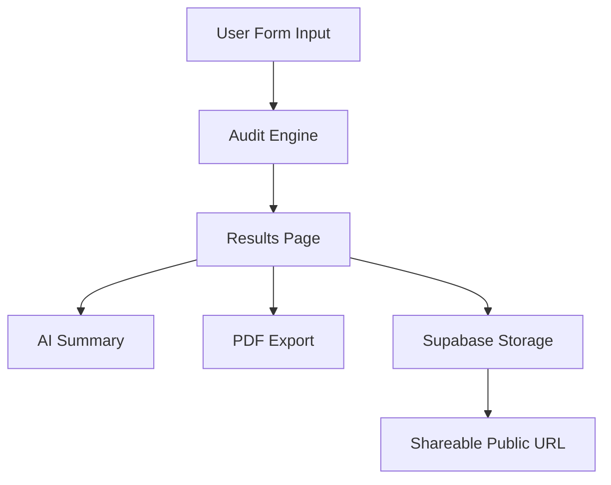

# Architecture

## System Overview

The AI Spend Audit platform is built using a modern full-stack architecture focused on rapid deployment, scalability, and maintainability.

---

# Stack

Frontend:
- Next.js
- React
- Tailwind CSS
- TypeScript

Backend:
- Supabase

Deployment:
- Vercel

Testing:
- Vitest

---

# Data Flow

1. User enters AI tool information
2. Form state is stored locally
3. Audit engine calculates recommendations
4. Results page displays:
   - recommended plans
   - estimated savings
   - AI-generated summaries
5. User can:
   - export PDF
   - generate shareable link
   - save audit data to Supabase

---

# Audit Engine Logic

The audit engine uses deterministic business logic rather than AI-generated calculations.

This approach was chosen because:
- pricing rules must be explainable
- financial recommendations should remain consistent
- assignment explicitly requested defensible reasoning

AI is only used for personalized summary generation.

---

# Why Next.js

- Fast development workflow
- Excellent Vercel deployment support
- App Router support
- API routes support
- Good TypeScript integration

---

# Why Supabase

- Easy PostgreSQL integration
- Hosted backend
- Simple REST APIs
- Good developer experience

---

# Scalability Improvements

If scaling to 10k+ audits/day:

- Add Redis caching
- Move calculations into API routes
- Add queue system for PDF generation
- Add CDN image optimization
- Add analytics pipeline
- Add monitoring and logging

---

# Mermaid Diagram

